<div align="center">

<pre align="center">
███╗   ███╗███████╗███████╗██╗  ██╗
████╗ ████║██╔════╝██╔════╝██║  ██║
██╔████╔██║█████╗  ███████╗███████║
██║╚██╔╝██║██╔══╝  ╚════██║██╔══██║
██║ ╚═╝ ██║███████╗███████║██║  ██║
╚═╝     ╚═╝╚══════╝╚══════╝╚═╝  ╚═╝
  O P T I M I S E R   ·   v 0 . 2 1 . 0
</pre>

### From bloated CAD to browser-ready, locally.

> Drop a STEP file in. Get a Meshopt-compressed GLB and an interactive viewer out.
> A self-hosted take on the Pixyz preprocessor. Python + your browser, no licence server.

[](https://www.python.org/)
[](https://github.com/CadQuery/OCP)
[](https://www.w3.org/TR/webgpu/)
[](https://github.com/google/draco)
[](#-license)
[](#-requirements)
[]()

</div>

---

## Screenshots

A 1,583-part, 5.4-million-triangle assembly in v0.11.

| | |
|---|---|
| 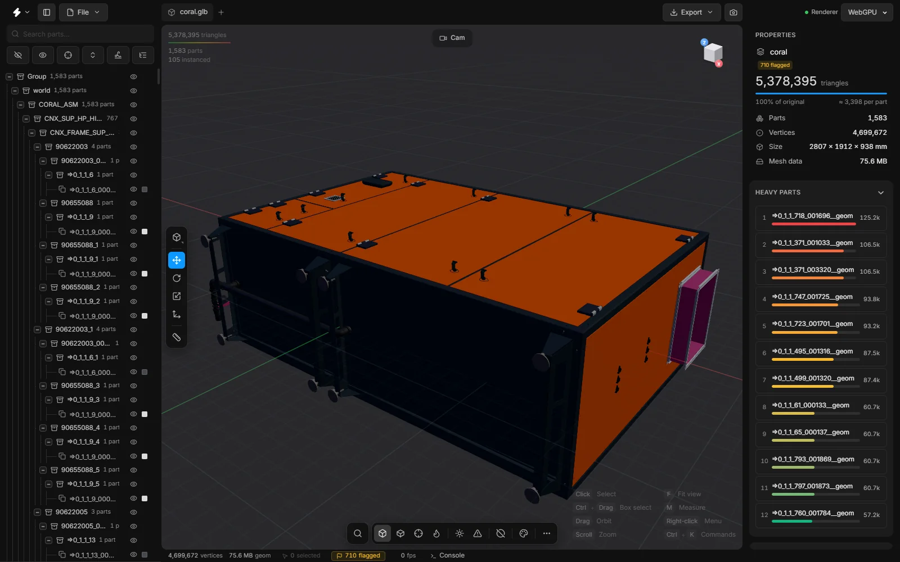<br>**The viewer** — tree, viewport, and the scene's totals | 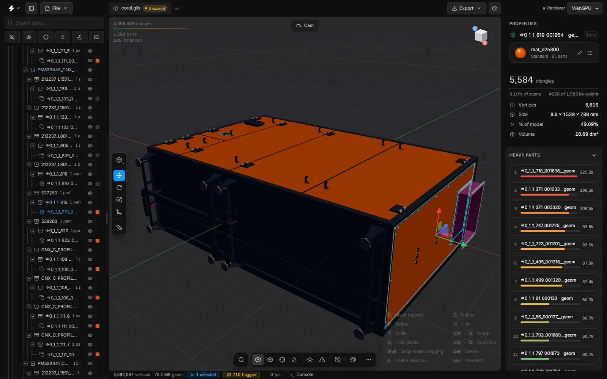<br>**Inspect** — a part's triangles, share of the scene and rank |
| 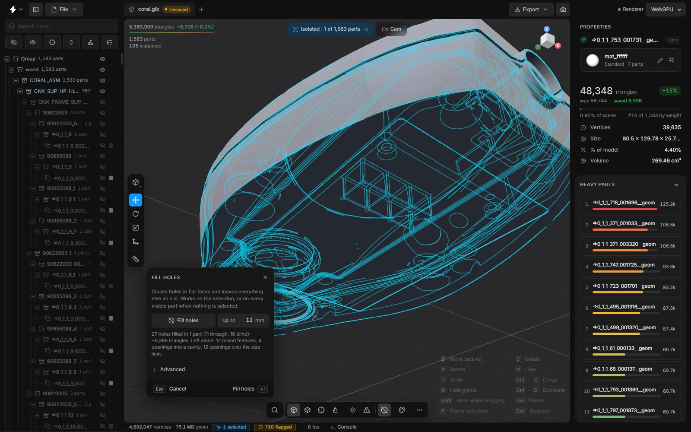<br>**Fill holes** — the command panel, and what the fill saved | 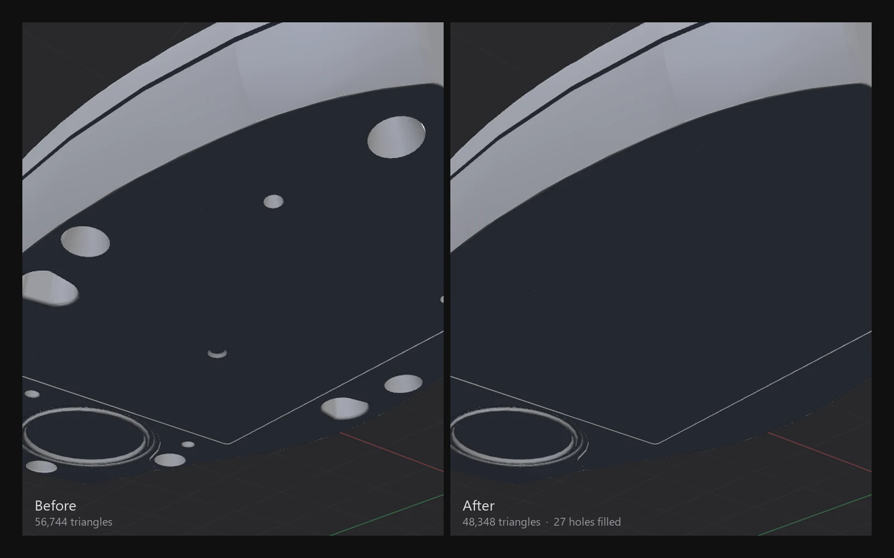<br>**Before / after** — 27 holes closed, the rest untouched |
| 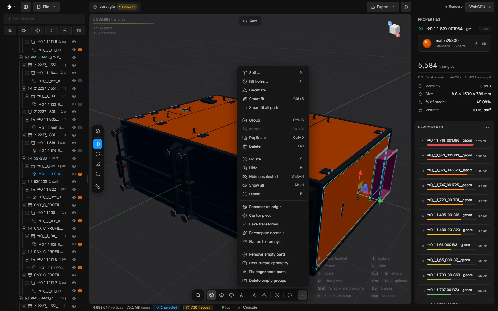<br>**All commands** — one list, with shortcuts | 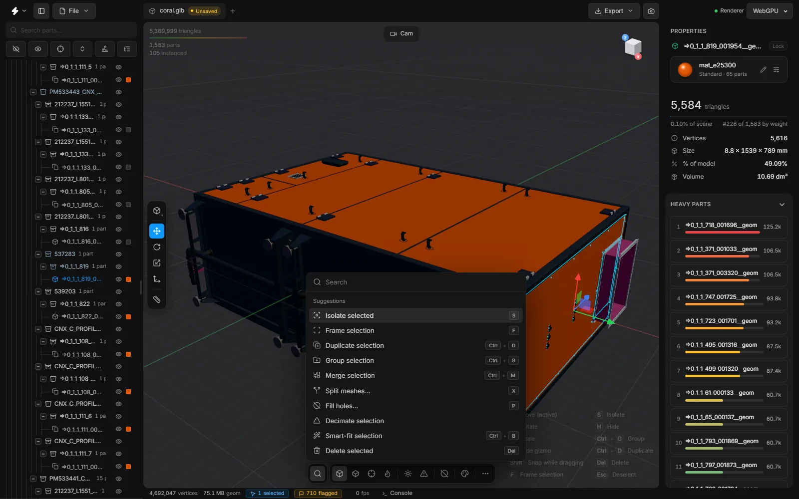<br>**Search** — suggestions follow the selection |
| 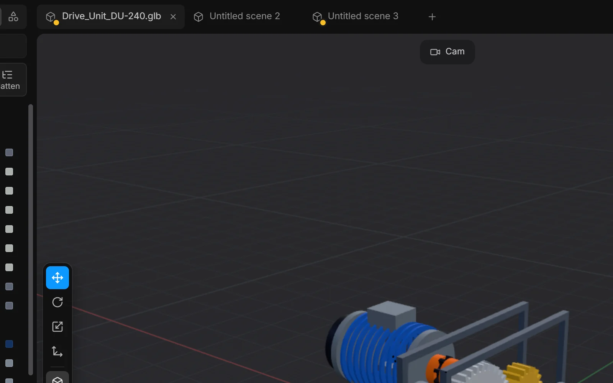<br>**Scene tabs** — every tab is its own scene | 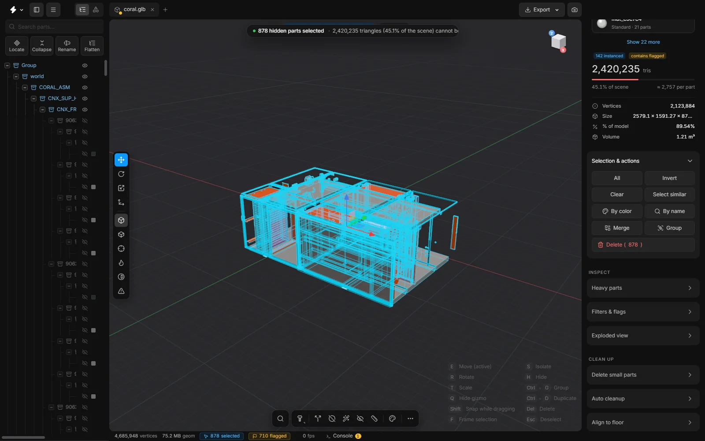<br>**Isolate** — one sub-assembly, 360 of 1,583 parts |
| 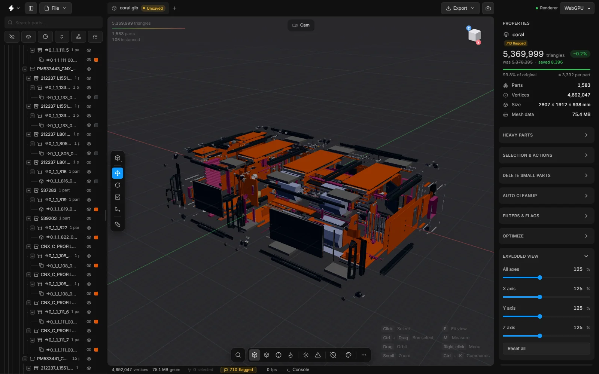<br>**Exploded view** — a slider per axis | 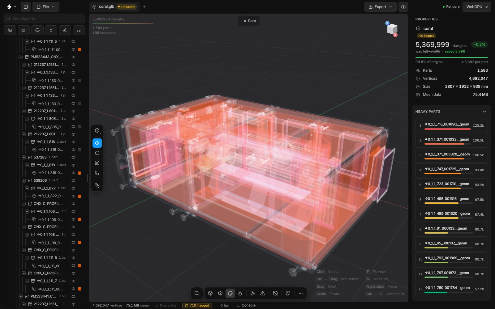<br>**X-ray** |
| 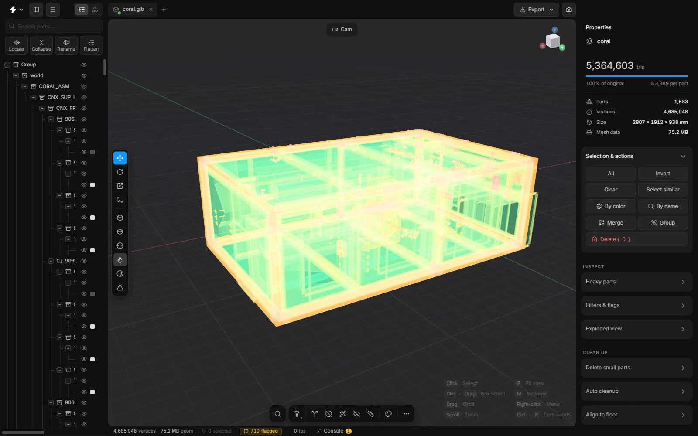<br>**Heatmap** — triangle density, beside the heavy-parts list | 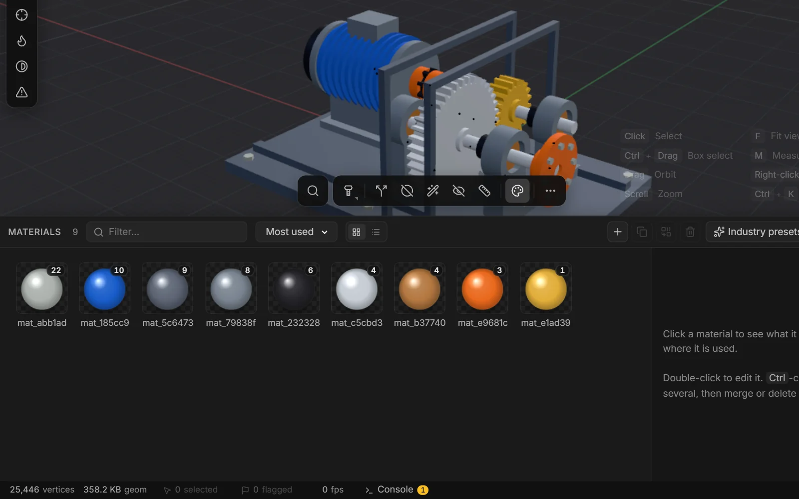<br>**Materials dock** — filter, sort, inspect |
| 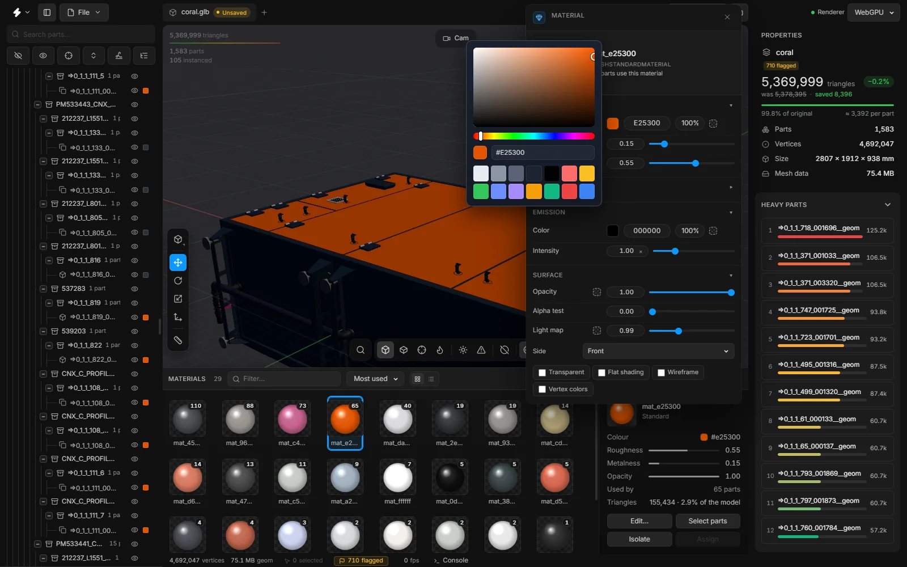<br>**Recolour** — every part that shares a material | 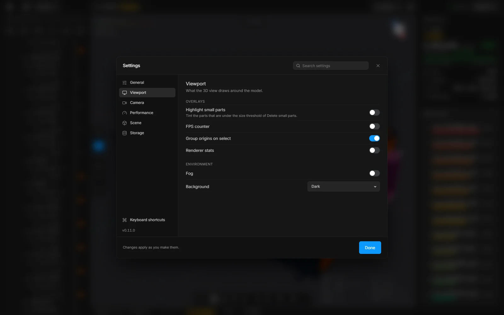<br>**Settings** — one window, with search |
| 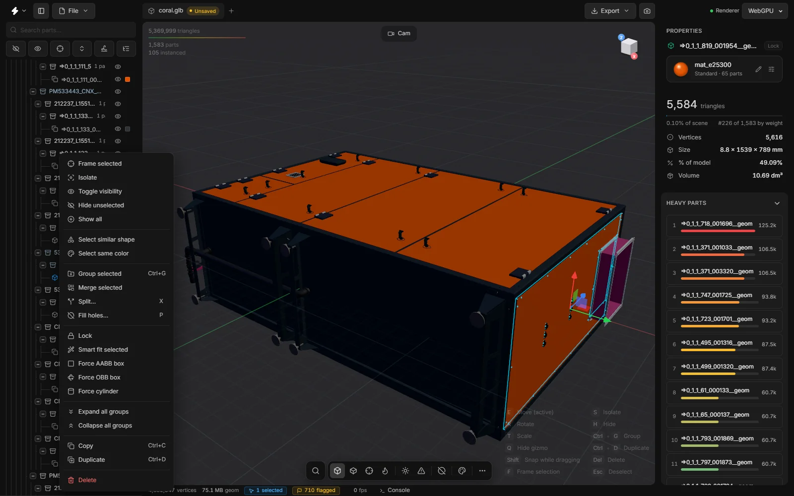<br>**Right-click menu** | 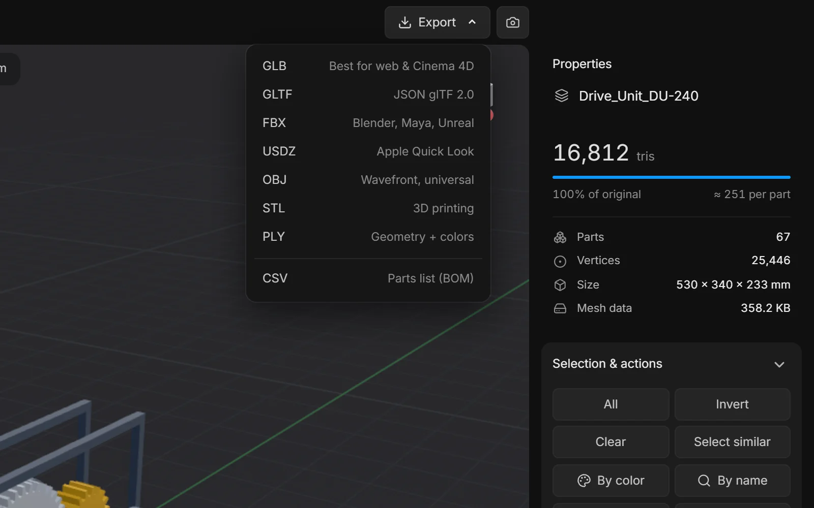<br>**Export** |

---

## Why

CAD assemblies are big. A real-world STEP file might contain 400 identical bolts,
80 duplicate brackets, and half a million degenerate triangles, and still expect
your GPU to render it.

The pipeline collapses what it can:

```
   400 bolts × 50 KB        →     1 mesh × 50 KB + 400 transforms
   80 brackets × 12 KB      →     1 mesh × 12 KB + 80  transforms
   500K bad triangles       →     adaptive retess, size-culled
   ───────────────────────────────────────────────────────────
   320 MB STEP              →     11 MB Meshopt-compressed GLB
```

---

## What's in the box

A CAD preprocessor, viewer, hierarchy editor, and exporter, in one local app.

- **Pose-normalized instancing** — PCA-based hashing detects duplicate geometry
  regardless of position or rotation. One GPU mesh, N transforms.
- **Editable assembly tree** — search, isolate, recolour, batch-rename, flatten,
  dissolve, ungroup. All undoable.
- **Two renderers** — WebGPU (default, with TSL nodes and `discardNode` clipping)
  and WebGL2. Hot-swap from the toolbar, no reload.
- **Resumable sessions** — FS Access API + IndexedDB persist file handles across
  reloads. Saved scenes for view/selection/recolour state.
- **Keyboard-first UX** — command palette (⌘K), shortcuts overlay, batch rename
  (F2), context menus, undo/redo.
- **No build step** — vanilla JS, native ES modules, CSS design tokens. Edit a
  file, refresh, done.
- **Non-destructive** — original geometry is never mutated until you export.

---

## ✨ Features

### 🛠 Pipeline (STEP → GLB)
| | |
|---|---|
| 🌳 **XCAF reader**              | Per-solid colours, names, and the full assembly tree pulled straight out of OCCT |
| 🧬 **PCA pose-normalized hash** | Same shape at any rotation/translation → **one** GPU mesh + N transforms |
| 🔷 **Adaptive tessellation**    | Absolute or relative to bbox diagonal · size culling for the tiny stuff |
| 📦 **Meshopt + Draco**          | Optional `EXT_meshopt_compression` via `gltfpack` — **~10× smaller GLBs** |
| ⚡ **One-click launch**          | `start.bat` / `start.command` bootstraps the venv and opens the app in a window of its own |
| 🔁 **Background jobs**          | Long conversions run as server jobs with live progress streamed to the UI |

### 🖥 Viewer & rendering
| | |
|---|---|
| 🌐 **Dual renderer**            | **WebGPU** (default) with hot-swap to **WebGL2** — pick from the toolbar |
| 💡 **PBR + AO + envmap**        | Studio lighting, ambient occlusion, screen-space reflections, fog |
| 🎯 **Pixel-perfect picking**    | Hover, click, marquee-select; works on instanced meshes |
| 👁 **Hide / Isolate / Solo**     | One key per mode — flatten the noise, focus on what matters |
| 🎨 **Recolor by group**         | Per-instance and per-material recolouring with reset baked-in |
| 📐 **Wireframe / Shaded / Matcap** | Three viewport modes, switchable mid-flight |
| 📊 **FPS pill**                 | Tabular-numeric FPS readout, colour-coded for stutter detection |

### 🧹 Mesh tools
| | |
|---|---|
| 🕳 **Fill holes** (`P`)         | Closes bolt holes, slots, pockets and engraved lettering in flat faces; leaves bosses, washer bores and cavity openings alone. Size limit in mm, watertight result, undoable |
| 🔩 **Fasteners**                | Finds bolts, screws, nuts and washers by their shape, whatever they are called, and selects them to isolate or delete; bushings, bearings, O-rings and pipe fittings are left alone |
| 🔻 **Decimate**                 | meshoptimizer simplifier — keeps normals, UVs and vertex colours; −25 … −90 % or a triangle target for the selection |
| 📦 **Smart fit**                | Replace parts with the best low-poly proxy: box, oriented box or cylinder |
| 🧽 **Clean-up**                 | Remove small, empty, duplicate and degenerate parts; delete empty groups; split fused meshes |
| 🎨 **Materials dock**           | Filter, sort and inspect materials; select or isolate the parts that use one; assign, merge, duplicate, PBR presets |

### 🧬 Hierarchy editing
| | |
|---|---|
| 🌳 **Live tree**                | 10 K+ nodes; only the rows on screen are built, so rebuilds stay in the tens of milliseconds |
| 🔎 **Search + filters**         | Fuzzy name search, "highlight small parts" tinting |
| ✂️ **Flatten / Dissolve**        | Collapse single-child chains, dissolve groups, ungroup scopes — all undoable |
| ✏️ **Batch rename (F2)**         | Token templates (`{name}`, `{idx}`, `{depth}`) + regex find/replace + presets |
| 🔄 **Undo / Redo**              | Tree edits, recolours, renames, flattens — all on a single timeline |
| 📌 **Right-click menu**         | Hide / isolate / recolour / rename / focus camera, all in one click |

### 📤 Export
| | |
|---|---|
| 📦 **GLB / GLTF**               | Draco + Meshopt compression toggles, optional embedded textures |
| 🎬 **FBX / USDZ / OBJ / STL**   | Common DCC + AR formats, scale presets (mm/cm/m/in) or custom |
| 🧷 **Save Scene**               | Snapshot view + selection + recolours into a sidecar `.scene.json` |

### 🧰 UX & polish
| | |
|---|---|
| 👋 **Welcome modal**            | Drag-drop, browse, recent files (IndexedDB-persisted handles) |
| 🗂 **Scene tabs**                | Every tab is its own scene, with its own undo history. New and Open never replace a scene that has something in it |
| 🧩 **Command panels**            | Split (`X`) and Fill holes (`P`) open as a panel beside the viewport: `Enter` runs, `Esc` puts it away |
| ⋯ **All commands**              | Every command that acts on the model in one list, with its shortcut; what cannot run now is dimmed |
| ⌘ **Search (⌘K)**                | Every menu item and every sidebar button and control, one keystroke away, with suggestions for the selection |
| 🔢 **Drag any number**           | Shape parameters and limits are numbers you drag sideways, or click to type. Shift ×10, Alt ÷10 |
| ⌨️ **Shortcuts overlay**         | Discoverable cheatsheet with live key bindings |
| ⚙️ **Settings window**           | General, Viewport, Camera, Performance, Scene and Storage in one place, with search |
| 🎨 **Design-token system**      | Centralised CSS variables — surfaces, radii, type scale, easings |
| 📋 **Copy log / Cancel load**   | Every long operation is observable and abortable |

---

## 🛠 Pipeline

```text
   ┌──────────────┐    ┌────────────────────┐    ┌────────────────┐
   │  .step / .stp│ ─▶ │ step2glb.py (OCCT) │ ─▶ │   .glb (Draco) │
   └──────────────┘    │ • XCAF tree        │    └────────┬───────┘
                       │ • PCA instancing   │             │
                       │ • Tessellation     │             ▼
                       │ • gltfpack/Meshopt │    ┌────────────────┐
                       └────────────────────┘    │ WebGPU viewer  │
                                                 │  index.html    │
                                                 └────────────────┘
```

---

## 🧰 Tech Stack

<div align="center">

`cadquery-ocp` · `trimesh` · `numpy` · **Draco** · **Assimp** (WASM) · **WebGPU** · vanilla JS

*No framework. No bundler. No npm install. Just open and run.*

</div>

---

## 🚀 Quick Start

```bash
# Windows
start.bat

# macOS
./start.command
```

> First run bootstraps `.venv`, pulls deps, opens the viewer.
> Subsequent runs are **~1 second**.

### 🧪 Direct CLI

```bash
python step2glb.py input.step
python step2glb.py input.step --quality 0.2 --min-size 0.5
python step2glb.py input.step --no-instance       # disable instancing (only with --no-colors, the plain reader)
python step2glb.py input.step --meshopt           # shell out to gltfpack
python step2glb.py input.step --relative          # quality as fraction of diag
python step2glb.py part.iges                      # IGES and BREP work the same way
python step2glb.py input.step --lod 100,50,25     # input.glb + input_lod1.glb + input_lod2.glb
python step2glb.py --batch cad/ --out glb/        # every CAD file in a folder
```

#### 📦 More than STEP

- **Formats.** The reader is picked by the extension: STEP (`.step` `.stp`),
  IGES (`.iges` `.igs`) and BREP (`.brep` `.brp`), in any case; the server's
  `/api/convert` takes the same six. IGES keeps the names,
  colours and layers the file has; it has no assembly structure, so repeated
  parts come out as separate geometry, and no part numbers. BREP is geometry
  only. IGES and BREP are often surface models with no solid: those are
  meshed as they are (an IGES face for face, one body per colour; a BREP one
  body per shell). A STEP with no solid is still refused. Anything with
  nothing to mesh, an unknown extension or a damaged file stops with a
  message that says why and writes no GLB.
- **Folders.** `--batch DIR` converts every supported file in `DIR` with the
  options you give, each in a process of its own, so one damaged file cannot
  stop the run. It prints a table (file, parts, triangles in and out, size,
  seconds, status) and writes `batch-report.csv` next to the results. `--out
  OUTDIR` collects the GLBs (and the report) in one folder, `--recursive`
  includes sub-folders (and keeps them under `OUTDIR`), `--file-timeout
  SECONDS` gives up on a file that hangs. Two files with the same name in
  different formats (`part.step`, `part.iges`) get `part.glb` and
  `part_iges.glb`. The exit code is 1 if any file did not convert.
  `step2glb.command` passes `--batch` on as it is; on Windows run
  `.venv\Scripts\python.exe step2glb.py --batch ...`, because `step2glb.bat`
  takes its first argument for a file.
- **LODs.** `--lod 100,50,25` writes the model at those percentages of its
  triangles: the first to `<name>.glb`, the others to `<name>_lod1.glb`,
  `<name>_lod2.glb`. Every level has the same nodes, names, instances and
  metadata. It uses meshoptimizer: gltfpack if it is installed (the same as
  `--simplify`), otherwise the copy bundled in `vendor/meshoptimizer/` through
  Node.js (`lod_simplify.mjs`; the browser app's Decimate uses that same
  file). With neither it stops and says so. `--lod-error E` (default 0.01, a
  fraction of each part's size) is the most a part may change; where reaching
  a percentage would exceed it, the level stays above it, and the log gives
  the real triangle count of every level. Cannot be combined with
  `--simplify`.
- **Metadata.** Each node of the GLB carries what the CAD file says about it
  in its `extras`: `name` (as in the CAD tree), `path` (`TestAsm/Bolt-3`),
  `product` (the part it is an instance of), `partNumber` and `description`
  (STEP `PRODUCT.id` and description), `color`, `layers`, `material`
  (`name`, `density`), `volume` and `area` (the file's validation
  properties, in model units). Only what the file holds is written. The
  scene's extras say which format it came from. It adds roughly 200 bytes
  per node; `--no-extras` leaves it out.

---

## 📋 Requirements

- 🐍 **Python** 3.10 / 3.11 / 3.12 *(3.13 blocked on cadquery-ocp)*
- 🌐 A **WebGPU-capable browser** (recent Chrome, Edge, Firefox, Safari)
- 📴 **No internet needed to run** — the viewer's libraries are bundled. Only a few rarely used converters are fetched on demand
- 💾 ~**2 GB** free for the venv on first install

---

## 🗂 Layout

```text
step2glb.py        STEP / IGES / BREP → GLB converter (OCCT + instancing, LOD, batch)
lod_simplify.mjs   the LOD simplifier when gltfpack is absent (Node, bundled meshoptimizer)
serve.py           local HTTP server + /api/convert endpoint
index.html         WebGPU viewer shell
app-v2.js          viewer logic (scene graph, picking, colour groups)
holefill.js        hole filler (pure module, no dependencies)
fasteners.js       fastener recogniser (pure module, no dependencies)
mesh-worker.js     background worker for Fill holes and Decimate
cloner.js          cloner (linear / grid / radial arrays)
tests/
 ├── selftest.js         in-app regression suite (?selftest)
 ├── holefill.test.mjs   hole filler on synthetic shapes (node)
 ├── converter.test.py   converter end to end: STEP / IGES / BREP, --batch, --lod, metadata, /api/convert (python)
 └── fasteners.test.mjs  fastener recogniser on built bolts, nuts, washers and look-alikes (node)
vendor/
 ├── three/            three.js r172: the WebGPU build and the add-ons in use
 ├── three-mesh-bvh/   pick acceleration
 ├── meshoptimizer/    simplifier (WASM, embedded)
 ├── lucide/           icon set
 ├── draco/            Draco encoder + decoder (WASM)
 ├── assimp/           Assimp.js (WASM)
 └── inter/            Inter variable font (SIL OFL)
fbx_*.py           FBX inspection / diff utilities
start.{bat,command}    one-click launchers
step2glb.{bat,command} headless converters
```

---

## 🩹 Troubleshooting

<details>
<summary><b>🪟 "python is not on PATH" on Windows</b></summary><br>
Re-run the Python installer and tick <code>Add Python to PATH</code>, or close + reopen your terminal so the new PATH is picked up.
</details>

<details>
<summary><b>🍎 "Operation not permitted" on macOS</b></summary><br>
Right-click <code>start.command</code> → <b>Open</b>. Gatekeeper blocks double-clicking freshly-unzipped scripts the first time.
</details>

<details>
<summary><b>📦 "ModuleNotFoundError: No module named 'OCP'"</b></summary><br>
Delete <code>.venv/</code> and re-run <code>start.bat</code> / <code>start.command</code> to rebuild from scratch.
</details>

---

## 🗒 What's New

**v0.21.0** — show it and ship it: a turntable video, export presets for where the file is going, and a Selection bar with the actions I reach for most.

- ![new][new] **Turntable video** — the film button next to the camera takes the camera once round the model and saves a WebM: 720p to 1440p, square or portrait, 4–12 s, 24/30/60 fps, fitted to the frame and looping. Encoded in the browser, nothing uploaded.
- ![new][new] **Where is it going?** — Web viewer, AR on iPhone, Unreal Engine, Unity and 3D print in the Export dialog: one press sets the format, unit scale, up axis, origin, merge and Draco.
- ![new][new] **Hide, Isolate, Frame and Duplicate** are buttons in the Selection bar.
- ![polish][polish] **A calmer Selection bar** — outlined buttons directly on the panel, the Delete count in the header, the selection actions in one bar under Properties.

**v0.20.0** — draw, organise and trust it: a Draw tool and Sweep, lines that are real parts of the scene, tree organising commands, IGES and BREP, and an app that closes its server with the window.

- ![new][new] **Draw (`L`)** — Pen, Rectangle, Circle, Arc, Polygon, Freehand and Edit, on the ground, front, side, view or the face of a part, with a field of snapping dots, typed sizes, Round and Bevel corners (drag the ring on the corner), Bezier handles that snap to the grid and break with Ctrl. **Sweep** carries a profile along a line.
- ![new][new] **Lines are parts** — a row in the tree, in groups, with the gizmo, Properties cards for the shape (width, radius, sides, corner) and the spline (type, close, interpolation, angle), and in GLB / glTF.
- ![new][new] **Organise the tree** — Remove group (keep contents), Flatten this group, Sort A–Z / Z–A, Move up / down, Delete empty groups, Expand / Collapse a branch; Ctrl and Shift pick groups and parts together.
- ![new][new] **The converter reads IGES and BREP,** converts a whole folder (`--batch`), writes LOD files (`--lod 100,50,25`) and keeps the CAD file's own data on the nodes.
- ![new][new] **Lighter files you can check** — copies are found in GLB, FBX, OBJ and 3MF files from other tools, Decimate "Within … mm" is measured, Export can check against a web page, Shopify, AR Quick Look or a phone app, Smart optimise keeps recipes, and Merge by colour.
- ![fix][fix] **Deduplicate geometry no longer deletes real parts,** Scan whole model no longer freezes the app, a leak in Split is closed, the floor grid is no longer cut off close up, and a scene scale change keeps the view.
- ![new][new] **The server closes with the window,** the converters with it; a crash is noticed at the next start; a warning when the graphics card is not used.

**v0.15.0** — the commands come to the pointer: a Quick wand ring on `W`, four clean-up tools, Untriangulate, a wireframe that shows polygons, and a scale handle for Dynamic place.

- ![new][new] **Quick wand** — hold `W` over the viewport: a ring of commands opens round the pointer. Move toward a slice and let go; a short flick is enough. With a selection it has Hide, Reduce, Delete and More; with nothing selected it has Fit view, Select all, View, Show all, File and Clean. Slices that hold a group fan out as soon as the pointer is on them (Decimate −25 % to −90 %, Smart fit, Split, Fill holes; the views; Save; the clean-ups), and a command that cannot run stays on the ring, dimmed, with the reason. A quick tap of `W` leaves the ring open to click. It never acts by accident: Esc, any other key, the wheel or a click outside closes it.
- ![new][new] **Repair mesh**, **Remove hidden faces**, **Merge by material or group** and **Select by rule** — four cards from the command palette (`Ctrl+K`).
- ![new][new] **Untriangulate** — flat neighbouring triangles become one polygon and are cut again with fewer triangles, with no change of shape. **Wireframe** is now the solid surfaces with a thin black line on every edge: Triangles, Polygons or Outline.
- ![new][new] **Decimate and Fit to budget** weigh normals, UVs and vertex colours, and the report shows how far the surfaces moved.
- ![new][new] **Dynamic place scale handle** — a small cube on top of the part: drag it up to grow the part, down to shrink it, with a ghost of the old size behind.
- ![polish][polish] **The animations in the Help cards are redrawn** to share one lighting and one material; the sidebar drag handles sit on the status-bar row.

**v0.14.0** — the biggest release so far: a CAD view, Dynamic place, an Align to floor that shows what it will do, Help inside the app, and a Settings window that changes the look.

- ![new][new] **CAD view and a Shading card** — key `6`; a strip of small 3D nuts, one for every look (Default, Clay, Porcelain, Steel, Red wax, and the CAD looks Ceramic, Light, Mono); one Outlines switch for the edge lines.
- ![new][new] **Dynamic place** — key `D`: drag the selected part over other surfaces; it rests on them and turns to face them.
- ![polish][polish] **Align to floor** shows a 3D drawing of what it will do and moves nothing until you press it; it is a floating card.
- ![new][new] **Help (F1)** — the whole knowledge base, with search, offline. **Settings › Appearance** — accent colours, tones, fonts, text size, corners, density.
- ![new][new] **Smart optimise**, **Fasteners** and **Stacked copies** clean a scene up for you; **Select similar** has a strictness slider; the library is a drawer.
- ![polish][polish] **Export window rebuilt** — file name pills, a summary, Flatten groups, ASCII STL. **Batch rename** redesigned with a Quick tab. A **splash screen** at start. Cards over the viewport can be moved.
- ![perf][perf] **Faster big models** — selection outlines and edge lines are drawn by the graphics card; the Recents picture and the spare tab wait until you stop clicking.
- ![fix][fix] **72 fixes**, among them Cinema 4D-ready FBX, a server that answers only the app, and undo for instanced parts. The full list is in [CHANGELOG.md](CHANGELOG.md).

**v0.13.0** — it feels like an app: installs to the desktop, opens in a window of its own, and the tabs grew up.

**v0.12.0** — the app builds as well as reduces: a library drawer of 86 parametric parts to drag onto the model, Align to floor, Select hidden parts, Fit to budget, Smart fit Boxes and Blocks, Clay view, and dark parts that have a shape.

**v0.11.0** — how the app is used changes: scenes in tabs, command panels beside the viewport, numbers you drag, one Settings window, and a speed pass on a 5.4M-triangle assembly.

**v0.10.1** — libraries bundled: the app starts without a CDN and works offline.

**v0.10.0** — the biggest release so far: new tools, and everything you touch is immediate.

- ![new][new] **Fill holes** — closes bolt holes, slots, pockets and engraved lettering in flat faces and leaves everything else untouched. It tells a hole from a boss, a washer's bore or an opening into a cavity. 4,136 holes (427,543 triangles) in about two seconds on the 1,583-part test assembly.
- ![new][new] **Decimate, rebuilt** on meshoptimizer — keeps normals, UVs and colours, takes a triangle target, and reaches the export.
- ![new][new] **Materials dock** — slides up like the console: filter, sort, and an inspector with Select parts / Isolate / Assign.
- ![perf][perf] **Speed** — selection, hover, delete, undo and view switching are immediate on a 5.4M-triangle assembly; the parts tree only builds the rows on screen; Fill holes and Decimate run in background workers.
- ![fix][fix] **Parts tree** — empty groups stay listed (a setting removes them automatically if you prefer), one scroll direction with every icon lined up, deleting a group deletes the group.
- ![new][new] **View cube and axis views** — click a face for Top / Front / Side / Back / Left / Bottom; orbit out to return to perspective.
- ![new][new] **Command search** finds every sidebar button and control.
- ![polish][polish] **Interface** — Plasticity-style viewport, one button scale, three corner radii, bundled Inter, fewer pop-ups.
- ![fix][fix] **Reliability** — every editing action can be undone; a rendering freeze after repeated mesh edits is fixed; Import → Append keeps the tree; Cloner copies are exported.
- ![new][new] **Tests** — `?selftest` runs 31 regression tests inside the live app (41 as of v0.11); `node tests/holefill.test.mjs` checks the hole filler.

See [CHANGELOG.md](CHANGELOG.md) for the full list and the known issues.

---

## 🧪 Self-test

Open the app with `?selftest` (`http://localhost:4242/?selftest`) to run the
regression suite inside the live app. It drives the tree, toolbar, dialogs
and context menu like a user would and checks undo/redo, exports, save
round trips and more; results appear in a panel at the bottom right and in
the console. `?selftest=groups` runs only the tests whose name contains
"groups". Nothing is downloaded — exports are captured in memory. Add a
test to `tests/selftest.js` whenever a bug is fixed.

The hole filler has its own suite, which needs only Node:

```bash
node tests/holefill.test.mjs
```

It builds plates, pockets, counterbores, engraved letters, a boss, a washer
and a hollow box, runs the filler on them and checks that the result is
closed, has the right volume, and is untouched where it should be.

The fastener recogniser has one too:

```bash
node tests/fasteners.test.mjs
```

It builds bolts, screws, nuts and washers to the ISO sizes, turns and scales
them, and checks that each is recognised with the right thread — and that
bushings, bearings, O-rings, cable glands, shafts and boxes are not.

---

## 📜 License

**MIT.** Do whatever — just don't blame me when your assembly tessellates into a black hole.

<div align="center">

✦  ✦  ✦

*Built for engineers who want their CAD to load before their coffee.* ☕

</div>

<!-- ── Changelog tag badges ───────────────────────────────────────────────
     Reference-style image defs used by the What's New block above and by
     CHANGELOG.md. Single source of truth: change the colour / label here
     once and every row in the changelog updates. Modern Linear / Vercel
     palette tuned
     for cohesion: every swatch is the same Tailwind-500 luminance so the
     changelog reads as one cohesive design system rather than six unrelated
     swatches.  `style=flat` for soft pill chips with rounded corners — the
     contemporary take on shield badges.
       new      #10b981  emerald 500  — feature additions
       fix      #f43f5e  rose 500     — bug fixes (warmer than fire-engine red)
       perf     #f59e0b  amber 500    — performance work
       polish   #a855f7  purple 500   — UX / visual refinement
       refactor #3b82f6  blue 500     — internal cleanup
       docs     #64748b  slate 500    — documentation
-->
[new]:      https://img.shields.io/badge/new-10b981?style=flat
[fix]:      https://img.shields.io/badge/fix-f43f5e?style=flat
[perf]:     https://img.shields.io/badge/perf-f59e0b?style=flat
[polish]:   https://img.shields.io/badge/polish-a855f7?style=flat
[refactor]: https://img.shields.io/badge/refactor-3b82f6?style=flat
[docs]:     https://img.shields.io/badge/docs-64748b?style=flat
